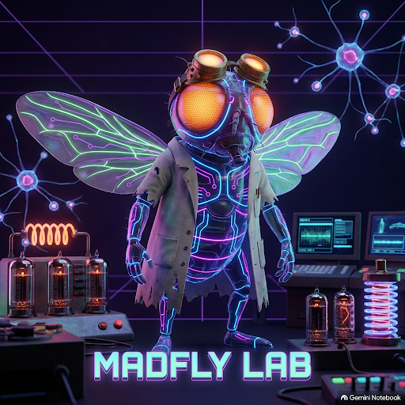

<div align="center">



# 🪰 MadFly Lab

**An unhinged 3D connectome sandbox for building mad insect brain experiences.**

`npm i` · `npm run pack` · `npm run dev`

</div>

---

Drosophila connectomics projects keep rebuilding the same scaffolding — a WebGL
viewport, a camera rig, a compound retina, a brain visualizer — before anyone
gets to the interesting part. MadFly Lab decouples **infrastructure and brain
diagnostics** from **experience logic**. You drop 3D stations into a lab, hook
them to real neurons, and spend your time on the experience.

```javascript
import { MadFlyLab, Station } from 'mad-fly-lab';

const lab = new MadFlyLab({
  mode: 'pruned-subgraph',
  canvas: '#app-canvas',
  circuit: 'courtship-and-foraging',
});

lab.addStation(new Station.SlotMachine({
  position: [3, 0, -2],
  lightBlinkHz: 12,
  onKick: () => lab.brain.injectCurrent('PAM11', +20),   // real dopamine neurons
}));

lab.addStation(new Station.FoodBowl({
  position: [-3, 0, 2],
  scentType: 'ORN_VA6',                                   // real glomerulus
  scentRadius: 5.0,
}));

await lab.start();
```

That is a complete scene. The arena, the avatar, the connectome, both runtimes
and the diagnostics HUD come with it.

---

## What you get

### 🧊 Kinematic Sensor-Block Avatar (`LabAvatar`)

Not a biomechanical body — `flygym`/NeuroMechFly already do MuJoCo leg dynamics
properly, and that is the right tool when the question is biomechanics. Here the
question is the brain, so the body is the cheapest thing that can carry real
sensors and obey real motor neurons.

| Sensor | Drives | Real cells |
|---|---|---|
| **Two compound eyes**, 721 hex columns each | `LPLC1_L/R`, `LPLC2_L/R` | 68/66, 94/91 |
| **Looming detector** per eye, motion opponency | `LC4_L/R` | 112 / 90 |
| **Olfactory receptors**, 4 glomeruli | `ORN_DM1/VA6/DA1/DA2` | 74 / 63 / 204 / 48 |
| **Touch** — click the fly | `touch` (tactile) | 2,558 |

Stations carry floor labels naming the real population each drives, and
`arrangeInRing()` surrounds the fly rather than scattering stations into one
quadrant. Built in: `Screen` (a canvas you can draw video or a game into, with a
PAM11 payout), `Workstation` (screen + keyboard — type and the fly watches),
`FoodBowl`, `HazardFan` (vertical rotor, so blades genuinely expand across the
visual field), `LightSwitch` (removes visual input outright), `SlotMachine`.

**Two eyes are not decoration.** The visual populations carry a real `somaSide`
annotation, and it is functional: driving only the left `LPLC2` cells yields a
`DNa01` steering signal of `1.1e-4`, driving only the right yields `1.5e-3` — a
13× asymmetry. Summing both eyes into one channel erases it, and the fly walks
in a straight line no matter what it sees. Giving each eye its own real neurons
turns a constant `−0.006` bias into a sign-changing `±0.19` steering signal:

| stimulus | steer | result |
|---|--:|---|
| bright **left** only | **+0.189** | turns left |
| bright **right** only | **−0.221** | turns right |
| brighter left | +0.122 | turns left |
| brighter right | −0.164 | turns right |

and the loop closes through real descending neurons:

| Output | Neuron | What it does |
|---|---|---|
| Steering | `DNa01` L−R | turn angle |
| Forward drive | `DNp09` | walking velocity |
| Escape | `DNp01` | Giant Fiber — the fly leaves |

Every one of those DNs is a verified clean left/right pair in `male-cns:v1.0`,
which is what makes reading steering as a left-minus-right difference mean
something.

### ⚡ Dual-Runtime Connectome Engine (`LabBrain`)

One API, two runtimes. A scene never branches on which one it got.

| | **Mode B** `pruned-subgraph` | **Mode A** `full-connectome` |
|---|---|---|
| Where | this browser tab | Python, over a WebSocket |
| Size | 715 – 7,638 real neurons | **176,422** real neurons, 25.7M synapses |
| Speed | **~1 ms/step**, 60 Hz easily | ~37 ms/step CPU; GPU optional |
| Device | CPU (typed arrays) | CPU or **CUDA GPU** — `--device auto` |
| Latency | zero | one round trip |
| Needs | a `.mflpack` file | `npm run brain:full` |

Mode A picks its device with `--device auto` (the default): it uses a CUDA GPU
if one genuinely works and falls back to CPU with the reason printed. `--device
gpu` makes a GPU mandatory; `--device cpu` forces CPU. GPU support is an
optional extra — `uv pip install -e "python/[gpu]"`.

`mode: 'auto'` uses Mode A if a server is up and falls back to Mode B if not.

### 🖥️ Visual Diagnostics HUD (`LabObserver`)

Three panels, zero setup: the live **retinal view** (actual hexagons, in axial
coordinates), the **3D soma point cloud** (real male-cns soma positions, glowing
by activation), and **telemetry sparklines** for PAM11 dopamine, PPL1 aversive
drive and motor output.

---

## Circuits

Each is a real pruned subgraph, built offline from the full connectome.

| Circuit | Neurons | Edges | gzip | For |
|---|--:|--:|--:|---|
| `minimal` | 715 | 46k | 84 KB | smoke tests, embedding in non-fly things |
| `escape-and-steering` | 4,963 | 437k | 1.1 MB | dodge and walk |
| `dopamine-mushroom-body` | 7,638 | 1.40M | 2.9 MB | reward/punishment learning substrate |
| `courtship-and-foraging` | 7,922 | 1.38M | 2.9 MB | the default — pheromone, food, escape |

```bash
cd python
uv run python scripts/build_pack.py --all --cache-dir ../../fly_simulation/.cache
```

Add your own in `python/src/madfly_lab/circuits.py`. The build **fails** if a
circuit names a cell type that does not exist in the dataset, rather than
shipping a channel that silently does nothing.

---

## Quick start

```bash
npm install
npm run pack        # build .mflpack files from the real connectome
npm run dev         # http://localhost:8330
npm run brain:full  # optional: Mode A server on ws://localhost:8770
npm test            # 36 tests against real packs
```

In the example scene: **1-4** camera modes (chase / orbit / fly's eye /
top-down), **R** reset, **H** hide the HUD.

---

## What is real, and what is not

This sits on published connectome data, so the line matters.

**Real.** Every neuron, every synaptic weight, every soma coordinate, from the
**MaleCNS v1.0** connectome. Cell types are addressed by their real NeuPrint
names. When you inject into `PAM11` you are driving 15 genuine dopaminergic
neurons, and whatever happens downstream happens through real measured wiring.

**Not real.** The dynamics are a rate model — `a ← tanh(W·a + I)` — not spiking
neurons, and there is no plasticity unless a scene adds it. Activations are
dimensionless values in `[-1, 1]`: **not millivolts, not Hz.**
`injectCurrent('PAM11', +20)` is input current in this model's own scale, and
the HUD's "Hz" axis is a display convention this framework invented. The retina,
the looming detector and the scent falloff are engineered image and geometry
measurements that *drive* real cells — they are not models of phototransduction,
LC4 physiology, or receptor binding. Motor gains converting activation to metres
per second are arena-scale constants with no biological derivation.

The connectivity is real. The labels we put on top of it are ours.

---

## Architecture

```
src/
  core/      lab.js · arena.js · station.js · gradients.js · theme.js
  avatar/    lab-avatar.js · retina.js · motion.js · olfaction.js
  brain/     lab-brain.js · pruned-runtime.js · remote-runtime.js · pack-loader.js
  observer/  lab-observer.js · retinal-view.js · soma-cloud.js · telemetry.js
  stations/  slot-machine.js · food-bowl.js · hazard-fan.js
python/
  madfly_lab/  connectome.py · circuits.py · prune.py · pack.py · brain.py · server.py
packs/       generated .mflpack binaries (not committed)
```

Per frame: arena renders the eye view offscreen → avatar senses into real
sensory neurons → stations tick → brain steps on a **fixed** timestep → real
descending neurons move the body → arena renders → HUD draws.

### Reading a channel: raw vs calibrated

Raw activations span ~1,900× across channels of a single pack — `PPL1` sits at
5.6e-2 under reference drive while `courtship_hub` sits at 2.9e-5 — because each
population is a different distance from the input in synapses and total weight.
Mode A reads quieter still, since the same signal spreads over 22× more neurons.

So every pack ships a **measured** reference response per channel, taken in the
network's linear regime and verified there (doubling the drive must double every
response, or the build fails):

```javascript
brain.read('DNp09')            // raw activation — honest, tiny, incomparable
brain.readCalibrated('DNp09')  // ~[-1,1] — threshold on THIS
brain.readLateralCalibrated('DNa01')   // calibrated left − right, for steering
```

`onSignal` thresholds and the telemetry HUD both use the calibrated value, so a
threshold written once holds across channels, circuits and runtimes.

### Poking the fly

Clicking the fly injects a pulse into 2,558 real `mechanosensory_tactile`
neurons. Measured, a poke raises the `touch` channel ~35,000×, lifts whole-
network activity 13×, and lights **~3,000 extra neurons** in the soma cloud.

What it does *not* do is make the fly jump. In this brain-only connectome,
tactile input reaches the descending motor neurons ~1000× more weakly than
vision does — those cells project largely outside this graph. That is real
anatomy, and turning the gain up until the body lurched would be inventing a
pathway the data does not show. Watch the brain panel, not the legs.

### Minting a fly

`lab.mintNewFly()` (or **N** in the example) gives the fly a new name, colours
and size from a seed. **Cosmetic only** — same connectome, same weights, same
behaviour. The knob that genuinely differs between runs is `noise`, which seeds
the network from a different real initial condition, and it is deliberately kept
separate so the colours never imply a different brain.

### A note on settling

With a static scene and no added noise the network reaches a fixed point and the
avatar's motion converges — a rate model has no adaptation or spontaneous
activity. Pass `noise` to `MadFlyLab` for a different real initial condition per
run, or drive a station to keep the input changing.

Read [AGENTS.md](AGENTS.md) before extending it.

---

## License & attribution

Code **Apache-2.0**. Connectome data **CC BY 4.0** — MaleCNS v1.0, FlyEM/HHMI
Janelia, University of Cambridge, MRC Laboratory of Molecular Biology, and
Google Research. Attribution ships inside every `.mflpack` header. See
[THIRD_PARTY_NOTICES.md](THIRD_PARTY_NOTICES.md).
